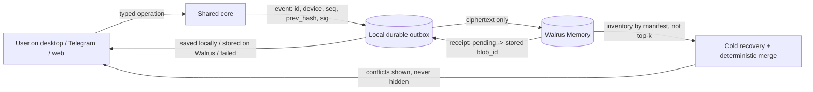

<div align="center">

# ◎ vow

**Make a commitment. Keep an honest record.**

Vow is a Commitment Steward: one assistant that helps you confirm a commitment, check in, correct the record without rewriting history, keep a schedule of reminders you define, and study material you upload. Its memory is designed to live in your own Walrus Memory account as encrypted, append-only records.

**Status (2026-10-04): working draft before implementation.** Nothing in this repository is a verified Mainnet-persistent service yet. Statuses below are honest; counts are re-measured before being quoted.

[](https://github.com/bagstreet/vow/actions/workflows/ci.yml)
[](LICENSE)

[Live web prototype (Vercel, not verified end to end)](https://vow-livid.vercel.app) · [Agent execution pack](internal/agent-pack/START_HERE.md) · [Discord](https://discord.com/invite/walrusprotocol)

</div>

---

## Navigation

| You are a... | Start here |
|---|---|
| Developer implementing the plan | [`internal/agent-pack/START_HERE.md`](internal/agent-pack/START_HERE.md) then [`TASKS.md`](internal/agent-pack/TASKS.md) (T00-T48; no cut line, one commit per task item) |
| Auditor / judge | [`internal/agent-pack/AUDIT_BRIEF.md`](internal/agent-pack/AUDIT_BRIEF.md), recovered audit evidence under `internal/agent-pack/audit-preparation/recovered/` (prior missing report not inherited) |
| Security reviewer | [`PRIVACY_ACCESS_ROUTING.md`](internal/agent-pack/PRIVACY_ACCESS_ROUTING.md) (Seal mode, RBAC, revoke vs forget vs delete, consent), [`DURABILITY_AND_CONTEXT.md`](internal/agent-pack/DURABILITY_AND_CONTEXT.md) (outbox, event model, merge, conflicts), [`SECURITY.md`](SECURITY.md) |
| Product / investor | [`PRODUCT_BRIEF.md`](internal/agent-pack/PRODUCT_BRIEF.md), [`VALUE_AND_AI_DESIGN.md`](internal/agent-pack/VALUE_AND_AI_DESIGN.md), [`COMPETITOR_MATRIX.md`](internal/agent-pack/COMPETITOR_MATRIX.md) |
| User asking "what does it store about me?" | [Access and privacy](#access-and-privacy) below |
| Historical plans (2026-10-01..03) | `packages/core/delivery/  adaptive delivery router: presence, quick replies, escalation (T47)
docs/              planning, audit and superseded preset docs (each starts with a reconciliation header saying what still applies |
```

## What Vow does (accepted scope)

One Steward, one ledger, three engine modules and five user-facing roles ([Roles and Routing](internal/agent-pack/ROLES_AND_ROUTING.md): Health & Fitness, Medication, Nutritionist, Health Companion, Study & Exam; several can be enabled at once, the AI routes each message and shows which role answered):

| Role | What it does | What it never does |
|---|---|---|
| **Core commitments** | create a confirmed commitment, check in (`done`/`skipped`), append a correction, audit, export, propose a feasible next step without shame | rewrite or delete history |
| **Schedule** ([spec](internal/agent-pack/VOW_SCHEDULE.md)) | you type items and times (pills, water, anything); Vow reminds you and records what *you* confirm: `taken` / `skipped` / `snoozed` (never counted as taken) or `unacknowledged`; at most two reminders per occurrence across all your devices; pause/resume; weekly counts | suggest or change doses, name medicines, check interactions, interpret symptoms, or treat silence as "skipped". Medical questions get a fixed refusal: *"I only keep the schedule you set. For medical questions ask a doctor or pharmacist."* |
| **Study** ([spec](internal/agent-pack/VOW_STUDY.md)) | owner uploads `.txt`/`.md`/text `.pdf` (<= 200 KB text) -> up to 10 lessons generated and **owner-approved** -> MCQ quiz graded by code -> mastery computed deterministically -> progress view. Vision (RAG, SM-2, exams, cohorts) is roadmap, labelled planned | grade by LLM alone, write raw documents to Walrus, follow instructions found inside uploaded text |

Surfaces: **Tauri desktop app with a local LLM (Ollama) is the primary surface** (native reminders, offline-capable, local-first outbox). Telegram and web are complementary. Slash commands and plain text map to the same typed operations: `/vow new`, `/checkin done|skipped`, `/correct <id>`, `/audit`, `/next`, `/export`, `/pause`, `/schedule add`, `/study upload` (full registry: `internal/agent-pack/DOMAIN_CONTRACT.md` §11, proposed).

## How memory works (design, to be verified in T02/T10)



- Every record is an **event** with a stable id, a per-device sequence and a hash link to the same device's previous event; devices sync by a deterministic merge; a signed checkpoint lists every branch head. Conflicting check-ins or corrections are shown as **conflicts** and resolved by a new correction, never silently. Details: `DURABILITY_AND_CONTEXT.md` section 9; exact proposed schema `DOMAIN_CONTRACT.md`. A fresh device restoring from Walrus sees a verified snapshot and says when its currentness is unknown; it never claims to have seen events an offline device has not yet synced.
- Only ciphertext is written to Walrus (client-side Seal "Manual" mode by default; if the day-0 spike T44 fails, a disclosed fallback encrypts at the app layer before the relayer). The UI always shows the active mode.
- The user is acknowledged only after the record is in the local write-ahead outbox; "stored on Walrus" appears only after the blob id is confirmed.

> **What is actually deployed today (2026-10-07):** the hash-chain/event-sourcing/Seal design above is the
> target architecture, not yet built against the live relayer (`packages/core/companion.mjs` is an unused
> prototype — see `docs/planning/KNOWN_LIMITATIONS.md`). What *is* live, verified against the real mainnet
> relayer: `packages/core/memory/walrus-memory.mjs`, called from the Telegram and Discord webhooks
> (`apps/web/api/{telegram,discord}.mjs`). Every chat turn and reminder check-in is written as a MemWal
> `remember()` call (relayer-encrypted at rest, not client-side Seal yet) into one namespace per app user
> (`vow:mem:<userId>`, shared across every channel they've linked — one memory, many doors in); the next chat
> turn recalls relevant past memories before the model replies. See `docs/MAINNET_EVIDENCE.md` for real blob
> ids. Slack is not wired to memory yet (Slack is also single-tenant today, see `docs/SELF_HOST.md`).

## Access and privacy

- **Stored:** your commitments, schedule labels and times, check-ins, corrections, consent records, Study lessons and progress; all as encrypted records in your Walrus Memory account (or the workspace account with roles).
- **Sensitive by inference:** a schedule label can reveal health. Vow treats schedule data as sensitive: encryption, roles, labels never in logs or summaries by default, no medical processing. Vow does not claim this is "not health data" and gives no legal guarantee; wording is reviewed by the owner.
- **Consent:** before the first reminder and the first Study upload you accept a short versioned consent text; withdrawing stops that processing and pauses the role. Pausing or withdrawing on one device takes effect on another device only once it syncs; an offline desktop cannot see a pause made in Telegram until it reconnects.
- **Roles:** owner / editor / viewer plus role modules, enforced on the bot server. Honest limit: the operator of a shared server can read what the server's delegate key decrypts; per-user accounts are a real cryptographic boundary and are the default for personal schedules.
- **Memory off:** no read, no write, no recall on any path; the reply says "memory off".
- **Revoke, forget, delete are different things** ([details](internal/agent-pack/PRIVACY_ACCESS_ROUTING.md#3-revoke-deactivate-forget-delete-four-different-operations-readme-section-required)): revoking a device or server stops new decryptions but does not recall copies already produced; `forget` hides records from recall but blobs persist until they expire or are deleted; permanent deletion of tracked blobs is an owner-wallet action (Walrus Memory Security Delete), executed per blob with per-item outcomes, and does not reach exports or texts already sent to an LLM provider you enabled. We do not use the words "crypto-shredding" or "GDPR compliant".
- **Local LLM:** on desktop, parsing and tone use Ollama; cloud providers run only if you enable them, and the UI says which one answered.

## Repository layout

```
apps/web/          landing and UI (Vite + React), deployed on Vercel                                                   [prototype, not verified end to end]
apps/api/          HTTP server and auth for the bot/web surface                                                         [prototype]
apps/cli/          `vow` CLI and HTTP launcher                                                                          [prototype]
apps/mcp/          MCP server                                                                                           [prototype]
packages/core/     hash-chain ledger, LLM chain, MemWal adapter + mock, write queue, decision advisor                   [legacy parts replaced by T04/T02]
packages/presets/  medication / nutrimind preset code                                                                   [legacy: superseded, to quarantine in T12]
examples/demo/     offline demo and tamper scripts                                                                      [prototype]
tests/             offline test suite (94 passing, 84 at restructure, 2026-10-06, `npm test`)                              [re-measure before quoting]
scripts/           setup, doctor, jury runners
spikes/            T44 Manual Seal experiments (paused; MVP uses MemWal relayer mode)
packages/core/delivery/  adaptive delivery router: presence, quick replies, escalation (T47)
docs/              planning, audit and superseded preset docs; each starts with a reconciliation header
```

## Quick start (prototype; see TASKS for the target build)

```bash
git clone https://github.com/bagstreet/vow && cd vow
npm install
cp .env.example .env      # provider keys and MEMWAL_* are optional for the offline demo; never commit .env
make setup                # verify + run the prototype tests (record the real result in docs/audit/ACCEPTANCE_STATUS.md)
make demo                 # offline tamper-evident chain demo against the MemWal mock
make jury                 # scenario runner
```
Desktop app (`desktop/`, Tauri + Ollama) and the Study/Schedule roles are tasks T37-T40 and do not exist in this repository yet. When they do, this section will list `cargo tauri dev`, the Ollama model to pull, and the device-link flow.

## Verification policy

| Claim | Where it is proven | Current state |
|---|---|---|
| Tests pass, coverage | `docs/audit/ACCEPTANCE_STATUS.md` after `npm test` on the current head | not re-measured since the audit; inherited numbers removed |
| Records stored on Walrus Mainnet | `docs/MAINNET_EVIDENCE.md`: blob ids, explorer links, agent/account id | yes — verified 2026-10-07 against the live mainnet relayer; see the doc for current blob count |
| Cold recovery | T06 test + desktop demo (T38) | not yet |
| Seal active | active-mode indicator + T44 spike log in `docs/audit/FRICTION.md` | not yet |
| Badges | generated from CI/eval output only | CI badge only |

## Why Walrus Memory and why an LLM

Memory is justified because commitments, check-ins, corrections, schedules and consent must survive device loss and be recoverable cold with an honest receipt state; a plain note would not change a later decision. The LLM is used only where judgement or parsing is needed (free-text reminder parsing with user confirmation, lesson generation with owner approval, tone of summaries); counting, scheduling, grading MCQs, mastery and audit are deterministic. Full argument: `VALUE_AND_AI_DESIGN.md`.

## Contributing and security

See [`CONTRIBUTING.md`](CONTRIBUTING.md), [`SECURITY.md`](SECURITY.md) and the hard rules in `internal/agent-pack/START_HERE.md`. Never commit secrets; never claim a live or verified state that `ACCEPTANCE_STATUS.md` does not record.

---

Built for [Walrus Session 8: Chatbots That Remember](https://www.deepsurge.xyz/hackathons/c0141a4a-21be-4009-bc63-7c168608c849). Rules snapshot: `docs/audit/OFFICIAL_RULES.md`. LLM disclosure: local Ollama model on desktop; cloud providers only when enabled (listed in the health endpoint). Memory: [MemWal](https://github.com/MystenLabs/MemWal) (version pinned in `package.json`; Mainnet status per `MAINNET_EVIDENCE.md`).


## Delivery routing (T47)

A reminder goes to the connected channel where you are online now, otherwise where you were active most recently, then by your priority list and the default order (desktop first). It carries quick replies (Taken / Skipped / Snooze) that are recorded as a check-in. With no reply within the ack timeout (default 10 min, configurable 2-120) it goes once to the next channel; never more than 2 sends per occurrence. If nothing is acknowledged the occurrence is `unacknowledged`, not `skipped`. Code: `packages/core/delivery/`; status: implemented and tested with mock adapters, real channels pending.

## Reminder delivery limitations
An unavailable assigned sender can miss reminders; there is no automatic takeover. Pause, withdrawal and revocation stop each device when observed; an offline sender may continue under its last allowed state until sync. Show controls-last-synced and device-may-still-send notices. Provider duplicates/drops are possible; unknown outcomes consume permits; no exactly-once delivery or instantaneous remote revocation is promised. DOMAIN_CONTRACT §§8–10 define the executable specification. Implementation and runtime gates remain unrun.
