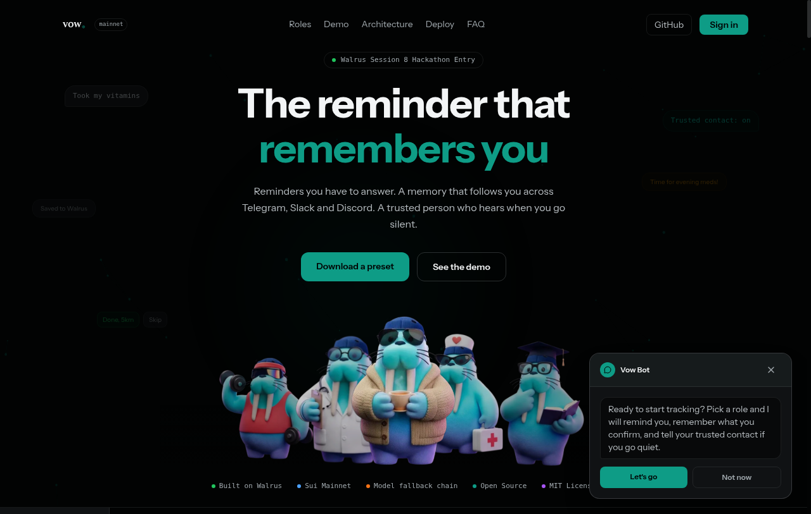
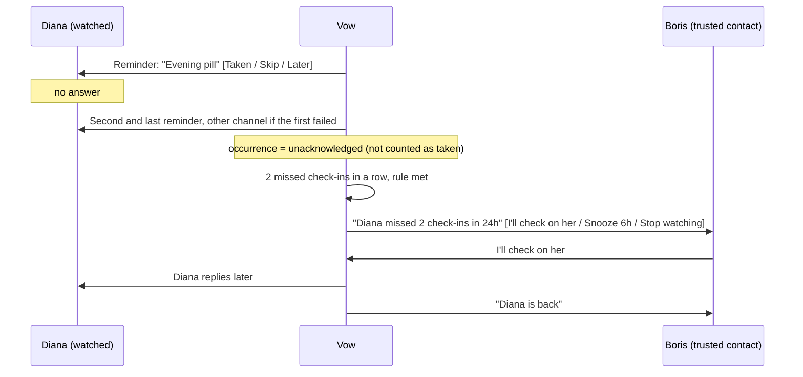
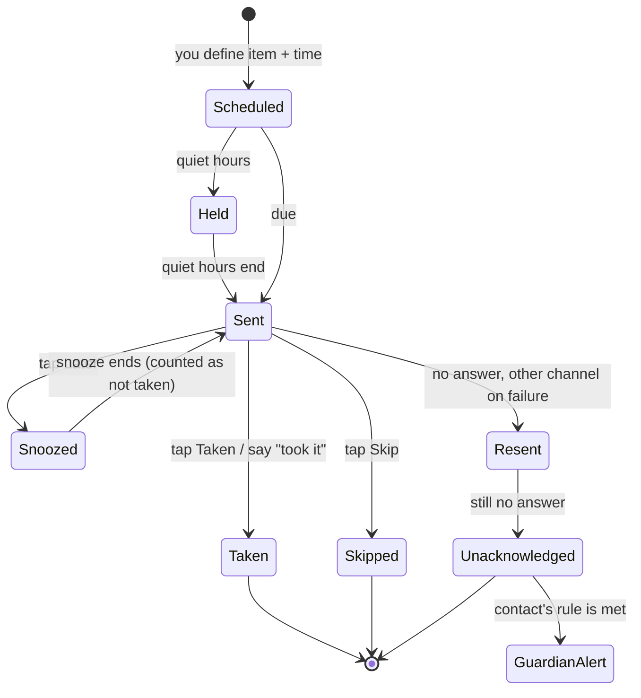
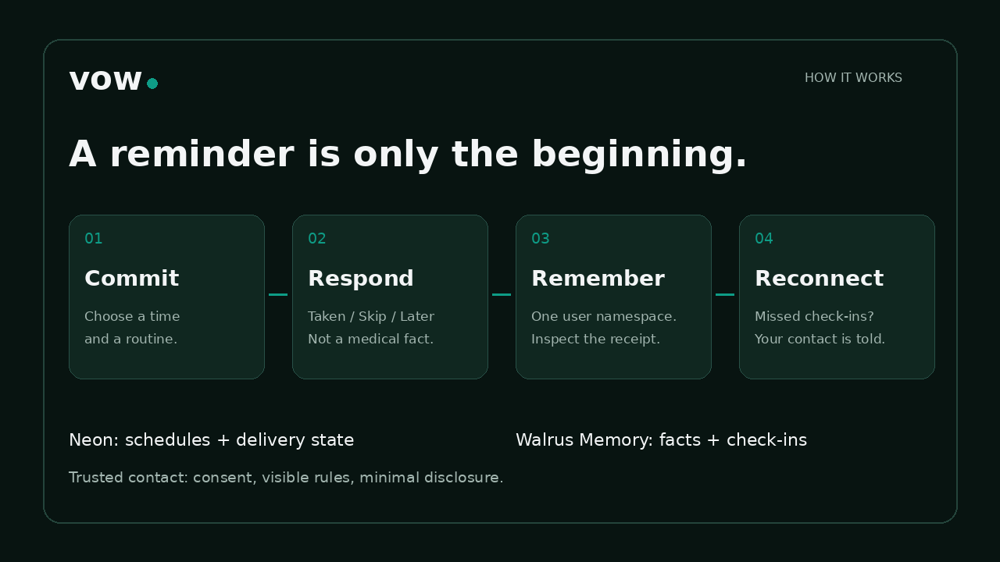
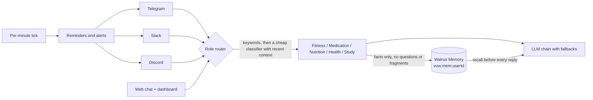
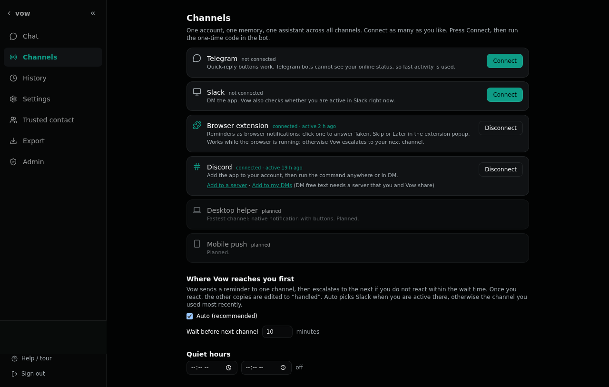

<div align="center">

# ◎ vow

**Make a commitment. Keep an honest record. And if you go quiet, someone who cares finds out.**

Vow is a commitment steward that lives where you already chat: Telegram, Slack, Discord, a web dashboard and a browser extension. It reminds you of what you promised, records what *you* confirm, remembers across every channel through [Walrus Memory](https://github.com/MystenLabs/MemWal), and can tell a person you trust when you stop answering.

[](https://github.com/bagstreet/vow/actions/workflows/ci.yml)
[](LICENSE)

[Live app](https://vow-livid.vercel.app) · [Telegram bot](https://t.me/VoW_rebot) · [Mainnet evidence](docs/MAINNET_EVIDENCE.md) · [Run it yourself](#run-it-yourself) · [Docs](docs/)

</div>



*Live product. Telegram, Slack, Discord, web and a browser extension connect to the same account.*

---

## The problem

- **You forget the pill, the call, the deadline.** A reminder app fires once, you swipe it away, and nobody knows whether you did it.
- **Every AI chat starts from zero.** You told a bot about your medication schedule on Monday; on Tuesday it has never heard of you, and on Slack it is a different bot again.
- **When something goes wrong, nobody notices in time.** You feel unwell, you miss two doses, you stop replying. The people who would help do not know.

Vow answers each of these with one mechanism: **a reminder you must acknowledge, a memory that follows you across channels, and a trusted contact who is told when acknowledgements stop.**

## A trusted contact, without sharing your whole history

> *You felt unwell and forgot your pills. Two check-ins pass with no answer. Your sister gets one short message: "Diana missed 2 check-ins in 24h, last reply 9 Oct 08:12." She calls you.*

You name another Vow user as your trusted contact. They choose the rules (N missed check-ins in a row, or N hours of silence after an unanswered reminder). You see every rule and can remove them at any time. Either side can leave.



Minimal disclosure by design: the contact learns *that* a check-in was missed, never the medicine, the label or the chat text. One alert per breach, then a cool-down. Vow is not an emergency service and says so. Use cases:

| Who | Pain | What Vow does |
|---|---|---|
| Someone managing a prescribed medication routine | Forgets doses when they feel ill, which is when it matters | Reminder with Taken / Skip / Later; a trusted contact is told after the misses you agreed |
| An adult child and an elderly parent | Worry without a way to check, calls that feel like nagging | The parent gets neutral reminders; the child is alerted only on a real pattern of silence |
| A student before exams | Plans slip silently | Study blocks, owner-approved lessons, code-graded quizzes, a nudge when a block is missed |
| Anyone who lives in three chat apps | Each bot knows only its own corner | One memory per person, shared by Telegram, Slack, Discord and web |

## From a reminder to a recorded response



At most two reminders per occurrence across all your devices. Delivery goes to the channel where you were active most recently (or the one you picked), falls back to your other linked channels on failure, honours quiet hours and can switch to a digest mode. One-time and recurring reminders are both supported, and you can write times in words ("at 12", "half past one", "tomorrow morning").



## One memory, many doors



- **Five roles** (Health & Fitness, Medication, Nutritionist, Health Companion, Study & Exam). Several can be on at once; each message is routed to one of them and the reply says which. Unmatched messages go to a small classifier that sees the last turns, not to a default role. Medication and nutrition keep a hard rule: no dose advice, ever.
- **Memory you can inspect.** Each remembered fact is a Walrus blob with a job id and a blob id, visible in History with a Walruscan link, with Forget (tombstone) and Remember now. A deterministic filter rejects questions, small talk and underspecified fragments before writing; it is a guardrail, not a truth detector.
- **Accounts that merge.** Sign in with Telegram, Discord, Slack or an email link; link the rest. Account merge follows seven explicit rules, blocked users are refused, admin has its own dashboard.
- **Agent API and MCP.** Role-scoped tokens let other agents write verified facts and read them back ([docs/API.md](docs/API.md)).



## Browser extension

Keep reminders within reach while you work. The [Chrome extension](apps/extension/README.md) pairs from Dashboard → Channels, polls once a minute while the browser is running, and opens **Taken / Skip / Later** in its popup. Mute temporarily or rank it with your other channels. A response closes the same reminder across linked devices. Chat and memory search in the extension are on the [roadmap](docs/ROADMAP.md).

## Run it yourself

Node 20+, a free Neon database, a Vercel project, and a Walrus Memory delegate key.

```bash
git clone https://github.com/bagstreet/vow && cd vow
npm install
npm test            # expect: all tests pass, 0 fail
cp .env.example .env   # paste placeholders: MEMWAL_PRIVATE_KEY, MEMWAL_ACCOUNT_ID, DATABASE_URL, bot tokens
```

Then follow [docs/SELF_HOST.md](docs/SELF_HOST.md): deploy `apps/web` to Vercel, point the Telegram, Slack and Discord webhooks at `/api/*`, and add a per-minute job that POSTs `/api/tick` with `x-tick-secret`. Every service and its free-tier limit is in [docs/SERVICES.md](docs/SERVICES.md). Each channel works independently: skip the ones you do not need.

## Navigation

| You are a... | Start here |
|---|---|
| User or judge | [Trusted contact](#trusted-contact-the-feature-that-changes-the-use-case), [live app](https://vow-livid.vercel.app) |
| Developer or agent builder | [docs/API.md](docs/API.md) (Agent API, MCP bridge, SDK) |
| Mechanics | [docs/MECHANICS.md](docs/MECHANICS.md), [docs/DIAGRAMS.md](docs/DIAGRAMS.md) |
| Self-hoster | [docs/SELF_HOST.md](docs/SELF_HOST.md), [docs/SERVICES.md](docs/SERVICES.md) |
| Plans | [docs/ROADMAP.md](docs/ROADMAP.md) |
| Security reviewer | [SECURITY.md](SECURITY.md), [Access and privacy](#access-and-privacy) |

## Access and privacy

- **Stored:** facts you tell the bot, reminder schedules and check-ins, in your Walrus Memory namespace; account, channel links and settings in the database.
- **Sensitive by inference:** a reminder title can reveal health. Vow does no medical processing and gives no doses; roles give general guidance only.
- **Memory off:** no read, no write and no recall on any path; the reply says so.
- **Forget** hides a record from recall. Walrus is append-only, so the blob itself stays until it expires.
- **Trusted contact** sees that check-ins were missed, never memory contents or chat text.
- **Honest limit:** the operator of a server holds the delegate key and can read what it decrypts. Run your own instance to own that boundary ([self-hosting](docs/SELF_HOST.md)).
- **LLM providers:** replies use a fallback chain of hosted models; the health endpoint lists which are configured.

## Agents, MCP and SDK

Role-scoped tokens let external AI agents write verified facts into a user's memory and read them back, limited to the roles the user allowed. REST, a stdio MCP bridge (`apps/mcp`) and a zero-dependency JavaScript client (`packages/sdk`) are described in [docs/API.md](docs/API.md).


## Repository layout

```
apps/web/          landing, dashboard and serverless API (Vite + React, Vercel)
apps/cli/          `vow` command-line client
apps/mcp/          MCP bridge to the Agent API
apps/extension/    browser notifications, check-in popup and mute
packages/core/     channels, memory, scheduler, trusted contact, admin, agent API
packages/db/       Neon migrations
packages/presets/  role presets
packages/sdk/      JavaScript client for the Agent API
docs/              mechanics, diagrams, services, API, roadmap
```


## Where this stops

- Memory is written through the MemWal relayer (encrypted at rest by the relayer). Client-side Seal, hash-chained event sourcing and cold recovery are designed, not built.
- Walrus Memory is append-only: Forget hides a record from recall but does not erase the blob.
- Scenarios S02 (mail provider down), S03 (database down) and S09 (account merge during a firing reminder) are covered by unit tests only, not by a live run.
- Vow is not a medical device or an emergency service. Roles give general guidance and never doses.

## Verification

| Claim | Proof |
|---|---|
| Tests pass | `npm test`, and the CI badge above links to the real run |
| Records stored on Walrus Mainnet | [docs/MAINNET_EVIDENCE.md](docs/MAINNET_EVIDENCE.md): job ids, blob ids and Walruscan links, TEST and DEMO accounts |
| Trusted contact alert on a real channel | live Telegram delivery verified 2026-10-09 |

## Why Walrus Memory and why an LLM

Walrus Memory stores user-reported facts and check-ins outside any one chat session, with a job id and a blob receipt. Recall supplies relevant context to later replies across linked channels. Neon holds operational account data, schedules and delivery state. Automated cold recovery is a planned capability, not a current guarantee. The LLM is used only where judgement or parsing is needed (free-text reminder parsing with user confirmation, lesson generation with owner approval, tone of summaries); counting, scheduling, grading MCQs, mastery and audit are deterministic.

## Contributing and security

See [`CONTRIBUTING.md`](CONTRIBUTING.md) and [`SECURITY.md`](SECURITY.md). Never commit secrets.

---

Built for [Walrus Session 8: Chatbots That Remember](https://www.deepsurge.xyz/hackathons/c0141a4a-21be-4009-bc63-7c168608c849). LLM disclosure: hosted models via the fallback chain listed in the health endpoint. Memory: [MemWal](https://github.com/MystenLabs/MemWal) (version pinned in `package.json`; blobs in [docs/MAINNET_EVIDENCE.md](docs/MAINNET_EVIDENCE.md)).

Last verified against `main` on 2026-10-09 (`npm test`: 378 pass, 0 fail, 1 skipped).
