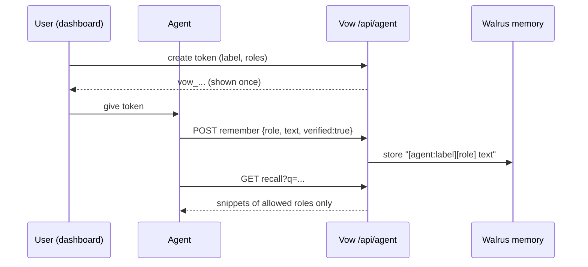

# Agent API, MCP bridge and SDK

External AI agents can read and write a user's Walrus-backed memory through a role-scoped token. An agent can write only verified facts, only for the roles the user allowed, and can read back only those roles.



## Token
Dashboard, Agents page: set a label and roles. Up to 5 active tokens per user. The raw token (`vow_...`) is shown once; only its hash is stored. Revoke at any time.

## REST
Base URL `https://vow-livid.vercel.app` (or your deployment). Header `Authorization: Bearer vow_...`.

| Call | Body / query | Result |
|---|---|---|
| `GET /api/agent?action=me` | | `{label, roles, limits}` |
| `POST /api/agent?action=remember` | `{role, text, verified:true}` | `201 {stored, jobId}` |
| `GET /api/agent?action=recall&q=...` | | `{results:[...]}` |

Limits: text 8 to 600 characters; 30 writes per hour per token. Errors: `401 unauthorized`, `403 role_not_allowed`, `400 verified_required | text_too_short | text_too_long | q_required`, `429 rate_limited`, `503 memory_unavailable`.

```bash
curl -s -X POST "$VOW/api/agent?action=remember" \
  -H "Authorization: Bearer $VOW_AGENT_TOKEN" -H "Content-Type: application/json" \
  -d '{"role":"fitness","text":"Ran 5 km in 28 minutes","verified":true}'
```

## SDK
Package `packages/sdk` (`vow-agent-sdk`), zero dependencies, Node 18+. Published on npm: `npm install vow-agent-sdk`.

```js
import { VowAgent } from 'vow-agent-sdk';
const vow = new VowAgent({ token: process.env.VOW_AGENT_TOKEN });
await vow.remember('fitness', 'Ran 5 km in 28 minutes');
console.log(await vow.recall('running'));
```

## MCP bridge
`apps/mcp/vow-agent-mcp.mjs` is a stdio MCP server exposing `vow_whoami`, `vow_remember`, `vow_recall`.

```bash
cd apps/mcp && npm install
```
```json
{ "mcpServers": { "vow": { "command": "node", "args": ["apps/mcp/vow-agent-mcp.mjs"],
  "env": { "VOW_AGENT_TOKEN": "vow_...", "VOW_API_URL": "https://vow-livid.vercel.app" } } } }
```

## Not provided
No webhooks and no hosted OpenAPI file yet (see ROADMAP). The CLI (`apps/cli`) is a user tool, not an SDK.
