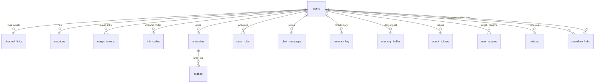
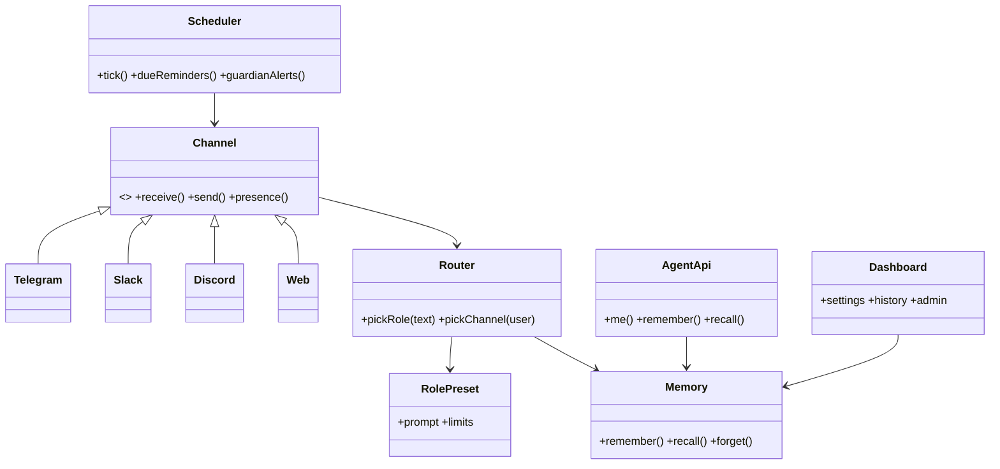
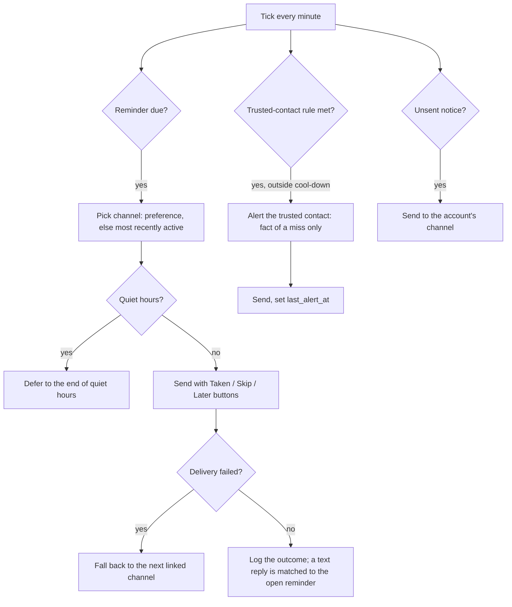

# Diagrams

Companion to [MECHANICS.md](MECHANICS.md) (login, merge, roles, reminders, memory writes, trusted contact). This file adds the structural views.

## 1. Data model

Everything user-owned references `users(id)` with `on delete cascade`, so account deletion removes all rows. Memory blobs on Walrus are append-only and are never rewritten; forgetting is a tombstone plus an alias entry.

## 2. Components

## 3. Notification mechanic

## 4. Account life cycle

```mermaid
stateDiagram-v2
  [*] --> Active: first sign-in
  Active --> Active: link / unlink channel or email
  Active --> Merged: link an identity that owns another account
  Merged --> Active: data combined (rules in MECHANICS section 2)
  Active --> Blocked: admin blocks
  Blocked --> Active: admin unblocks
  Active --> Deleted: owner confirms deletion
  Blocked --> Deleted: owner confirms deletion
  Deleted --> [*]: rows cascade; counterparts notified first
```

Administrators cannot delete an account. Only its owner can.
