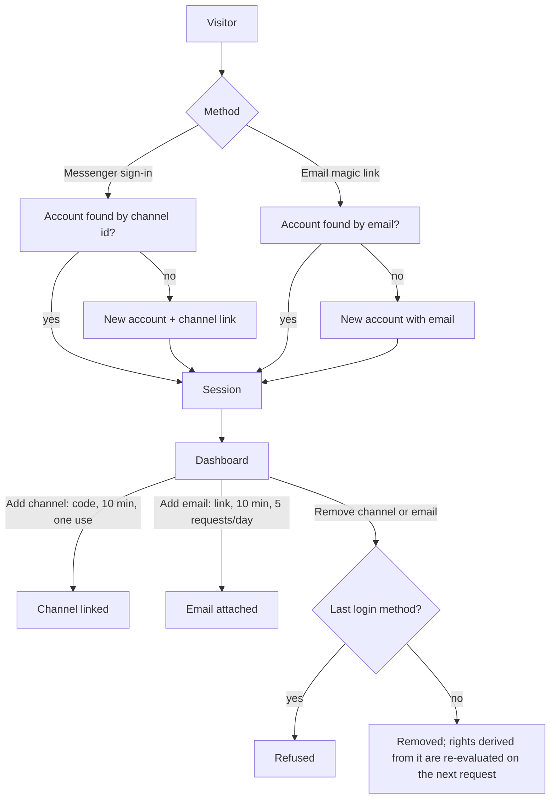
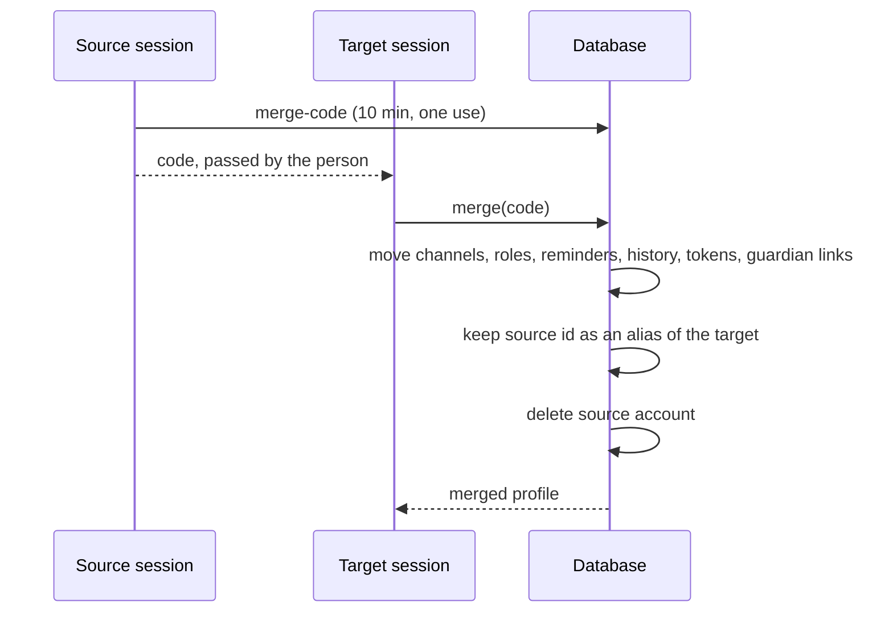
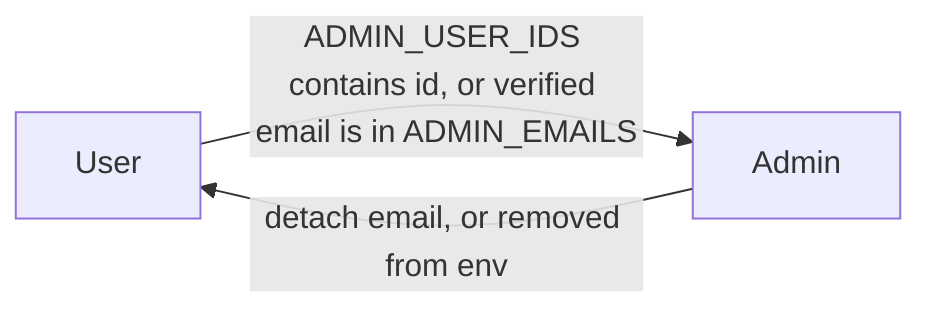
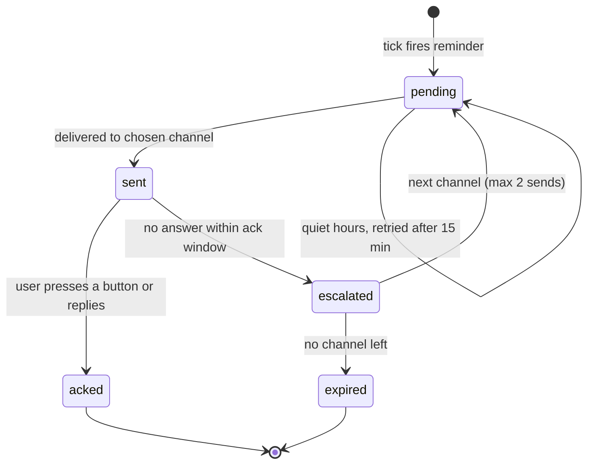
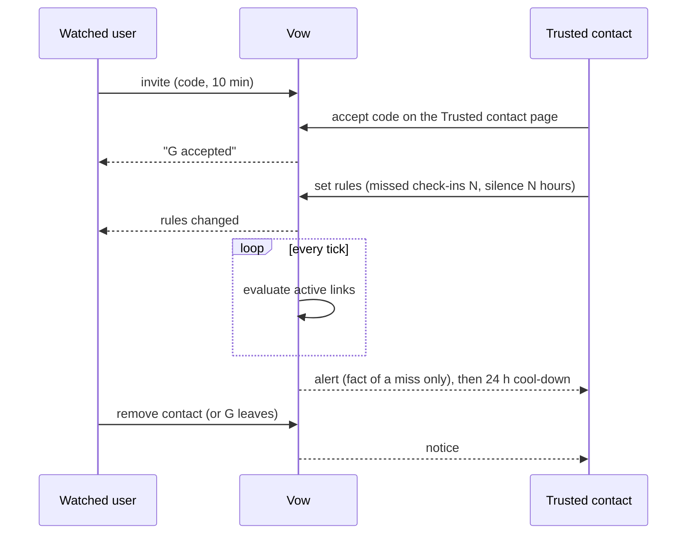

# Mechanics reference

Each section gives a diagram and the rules behind it. Diagrams are Mermaid and render on GitHub.

## 1. Accounts, login and linking

A Vow account is one row in `users`. It is reached through one or more login methods: a messenger channel (Telegram, Slack, Discord) or a verified email.

Rules
- A channel or an email belongs to exactly one account.
- The last remaining login method cannot be removed.
- Email links are single use, expire after 10 minutes and are limited to 5 requests per user per day.
- Slack and Discord sign-in works only for users of the workspace or server where the app is installed. A self-hosted installation works in its own workspace.

## 2. Account merge

When a person ends up with two accounts, they are merged from the signed-in session of the account that stays (the target). The other account (the source) issues a one-time code in its own session.

Rules
1. The target profile and settings win; source settings are discarded.
2. Channels move to the target.
3. Roles are the union; a role enabled on either side stays enabled.
4. Reminders move; exact duplicates (same role, time, days, title) are dropped.
5. Chat history, memory log, write buffer, outbox and agent tokens move to the target.
6. Memory written under the source id stays readable: the source id becomes an alias of the target, and recall covers all aliases. Blobs on Walrus are immutable and are not rewritten.
7. An email moves only if the target has none. Guardian links move; duplicates and links between the two merged accounts are dropped.

## 3. Roles: user and admin

There are two roles. The admin is a user with extra capabilities; everything a user can do is available to the admin.

- First admin: set `ADMIN_USER_IDS` (account id) or `ADMIN_EMAILS` (verified email) in the deployment environment. An account that signed in through Telegram has no email; use its id, or attach an email in Settings first.
- Admin rights are derived on every request, so detaching the email or editing the variable removes them immediately.
- The admin can list users (masked email, channels, counts), block and unblock users, and edit settings. The admin cannot delete accounts, cannot be blocked, and cannot read memory or messages of other users.
- A blocked user is signed out, receives "Your Vow account is suspended" in every channel, gets no reminders, and keeps their data.

## 4. Reminders and delivery

Channel choice, in order: the reminder's own channel, then the user's priority list, ordered by Slack presence and last activity. After an acknowledgement in one channel, copies in other channels are edited to "handled". A scheduler tick runs every minute (cron-job.org) with a GitHub Actions backup every 5 minutes; claims are compare-and-swap, so overlapping ticks never double-send.

## 5. Memory writes

| Mode | Behaviour |
| --- | --- |
| Instant (default) | Every remembered fact becomes one Walrus blob |
| Digest | Facts are buffered per user and written as one blob once the oldest entry is older than `digest_hours` |
| Remember now | "Remember now" in History, or an explicit request in chat, writes immediately |
| Forget | The entry is hidden from recall (tombstone); the blob stays on the network |

The mode and `digest_hours` are administrator settings, so a deployment can trade blob count against cost.

## 6. Trusted contact

- Both sides are Vow users. At most 3 trusted contacts per account; one account can watch at most 10.
- Only the trusted contact sets the rules; the watched user is told about every change and can remove the contact at any time.
- Alerts contain only the fact of a miss, never message or memory content. Vow is not an emergency service.
- Account deletion notifies the counterparts first, then the links are removed by cascade. Deleting a trusted contact's account tells every watched user that protection is off.
- Notices go to the recipient's most recently active channel; if none exists they remain in the dashboard.
