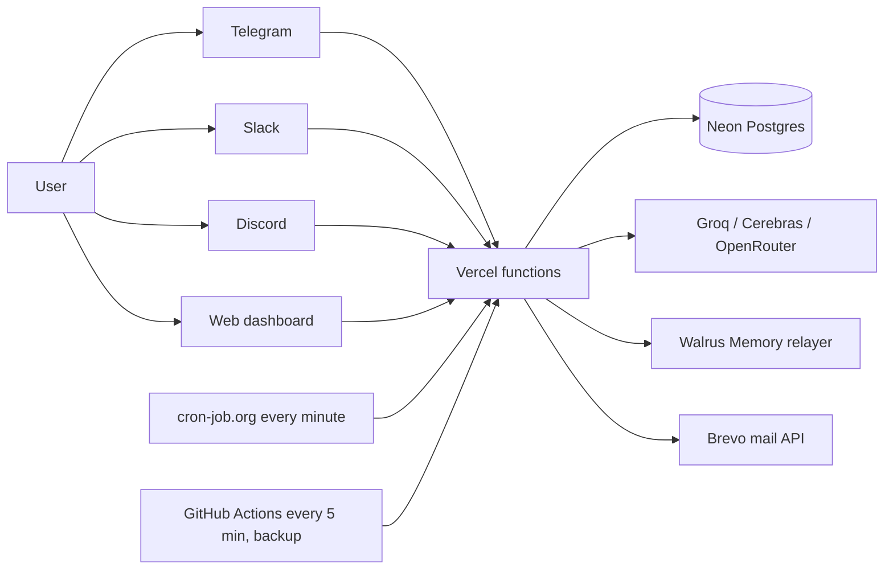

# Services and configuration

Vow runs on free tiers only. This is a deliberate choice: anyone can reproduce the full deployment with no budget, test ideas, and replace any component later. Nothing below requires a paid plan.

## Service table

| Service | Used for | Free-tier limit that matters | Settings you must make |
|---|---|---|---|
| **GitHub** | Source, CI (`ci.yml`), backup tick (`tick.yml`), weekly DB dump (`backup.yml`) | 2000 CI minutes/month (private repo) | Fork the repo. Optional Actions secrets: `TICK_SECRET`, `WEB_BASE_URL`, `DATABASE_URL_DIRECT` |
| **Vercel** | Static site plus serverless API in `apps/web/api` | 12 functions per deployment (Hobby); Vow uses 8 | Import the repo, set root directory to `apps/web`, add the environment variables below |
| **Neon** | Postgres: accounts, links, reminders, check-ins, guardian links | 0.5 GB storage | Create a project, copy the pooled URI into `DATABASE_URL`, run `node packages/db/apply.mjs` |
| **cron-job.org** | Per-minute scheduler, because Vercel Hobby cron runs once a day | Minimum interval 1 minute | New job, `POST <WEB_BASE_URL>/api/tick`, header `x-tick-secret: <TICK_SECRET>` |
| **Brevo** | Sign-in links and notices by email | 300 mails/day | Verify a sender address, create an API key, set `BREVO_API_KEY` and `MAIL_FROM` |
| **Telegram** | Bot channel and Telegram sign-in | none | @BotFather: `/newbot`; register the webhook (see SELF_HOST step 5) |
| **Slack** | Bot channel and Slack sign-in | Single workspace per app | Create the app, scopes `chat:write im:read im:history users:read`, subscribe to `message.im`, enable Delayed Events, set Request URL and Redirect URL |
| **Discord** | Bot channel and Discord sign-in | none | Create the application, set the Interactions Endpoint URL, add the OAuth redirect `<WEB_BASE_URL>/api/dash?op=oauth-callback&provider=discord` |
| **Walrus Memory** | Long-term memory, written as blobs on Walrus | Network gas for mainnet | Create an account and a delegate key; set `MEMWAL_*` |
| **Groq / Cerebras / OpenRouter** | LLM routing; at least one is required | Per-provider rate limits | Set at least one API key; order with `LLM_PRIMARY` |

## Environment variables

| Variable | Required | Meaning |
|---|---|---|
| `DATABASE_URL` | yes | Neon pooled connection string |
| `WEB_BASE_URL` | yes | Public URL of the deployment, no trailing slash |
| `TICK_SECRET` | yes | Shared secret for `/api/tick` |
| `TELEGRAM_BOT_TOKEN`, `TELEGRAM_WEBHOOK_SECRET` | for Telegram | Bot token and webhook secret |
| `SLACK_BOT_TOKEN`, `SLACK_SIGNING_SECRET`, `SLACK_CLIENT_ID`, `SLACK_CLIENT_SECRET`, `SLACK_TEAM_ID` | for Slack | Bot token, request signing, sign-in |
| `DISCORD_BOT_TOKEN`, `DISCORD_PUBLIC_KEY`, `DISCORD_CLIENT_ID`, `DISCORD_CLIENT_SECRET` | for Discord | Bot, request verification, sign-in |
| `GROQ_API_KEY`, `CEREBRAS_API_KEY`, `OPENROUTER_API_KEY` | one of | LLM providers; `LLM_PRIMARY`, `LLM_ROUTE_CHAT` set the order |
| `MEMWAL_PRIVATE_KEY`, `MEMWAL_ACCOUNT_ID`, `MEMWAL_SERVER_URL` | for memory | Delegate key and account; without them nothing is written to Walrus |
| `BREVO_API_KEY`, `MAIL_FROM` | for email sign-in | Transactional mail |
| `ADMIN_USER_IDS`, `ADMIN_EMAILS` | optional | Comma-separated first administrators; matched by account id or verified email |

## Why the scheduler is a separate service

Vercel Hobby allows cron jobs at most once per day, and reminders need minute precision. cron-job.org calls `/api/tick` every minute; GitHub Actions calls it every five minutes as a backup. The tick is idempotent: a reminder occurrence is claimed in the database before it is sent, so two callers in the same minute never produce two messages.

A single always-on host removes the need for the external scheduler. The Docker alternative is to run the same handlers behind any Node server with an internal timer calling the tick; the code has no Vercel-specific state.

## Slack and Discord sign-in scope

Slack sign-in is valid only for the workspace that owns the app (`SLACK_TEAM_ID`); users from other workspaces receive `invalid_team_for_non_distributed_app`. A self-hosted deployment therefore works in the installer's own workspace. Discord and Telegram have no such restriction.
